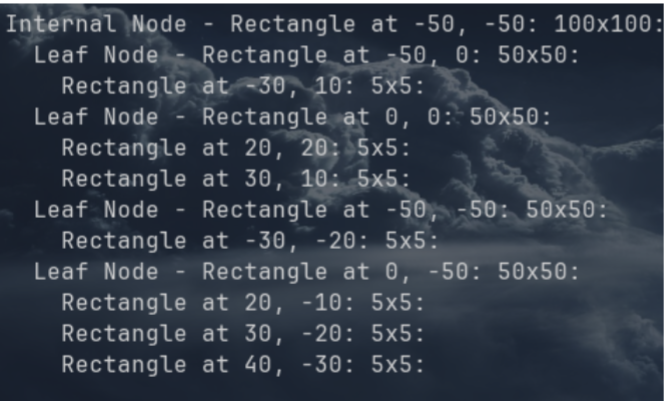

# Insert X Y L W
Insert a rectangle into the quadtree as the specified X and Y coordinates with the specified length and
width. 

- If there is already a rectangle at the specified position, your program should terminate, and you
should print a message saying, 
    - **“You can not double insert at a position.”**

# Find X Y
Prints the rectangle at the specified X and Y positions. Printing a rectangle should result in:

- Output format:
    - **Rectangle at [X], [Y]: [L]x[W]**

- For example, one rectangle may result in:
    - **Rectangle at 10, 10: 5x5**

- If a rectangle is not found at the specified XY coordinates, your program should terminate, and you
should print a message saying, 
    - **“Nothing is at [X], [Y].”**

# Delete X Y
Deletes the rectangle at the specified XY coordinates. 
- If a rectangle is not found at the specified XY
coordinates, your program should terminate, and you should print a message saying, 
    - **“Nothing to delete at [X], [Y].”**

# Update X Y L W
Updates the length and width of the rectangle at the specified XY coordinates. 

- If a rectangle is not found
at the specified XY coordinates, your program should terminate, and you should print a message saying,
    - **“Nothing to update at [X], [Y].”**

**Note that updating the length and width of a rectangle will never move the rectangle to another node. It is the length and width relative to the bottom left corner.**

# Dump
Prints the entire quadtree. For each level of the tree (the head is at level 0, its children are at level 1,
grandchildren at level 2, etc.), you should begin each line with an extra tab. For example:

**Note:**
• The order of printed children does not matter as long as they’re under the correct parent.
• The order of printed rectangles does not matter as long as they’re under the correct node.
• Each node prints its space, which is the exact same as printing a rectangle. You can take
advantage of that.

